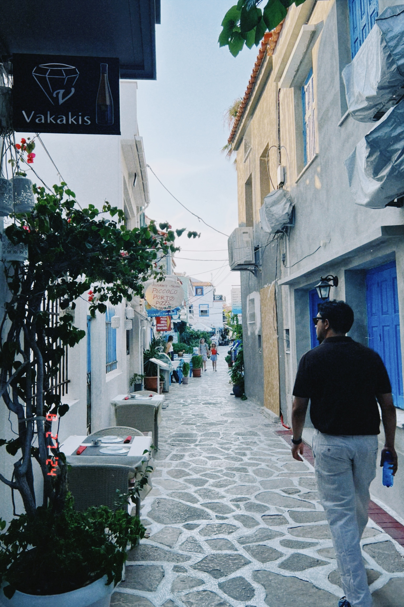

Hi there! My name is Ugur Köysüren, and I’m a Senior IT Consultant with expertise spanning backend, frontend, DevOps,
and cloud technologies. My life mission involves designing scalable systems, solving challenging problems, and
optimizing workflows to keep projects running smoothly and teams happy.

With 8 years of experience in the industry, I’ve worked on a variety of projects, from architecting cloud-based
solutions to integrating complex systems. Whether it’s helping teams adopt agile practices, delivering insurtech
solutions, or automating infrastructure, I bring a blend of technical depth and practical problem-solving to every
endeavor.

## Education and Certifications

My journey in tech began with an M.A. in Business Information Systems from Boğaziçi University and a B.Sc. in
Electrical & Electronics Engineering from Özyeğin University. Along the way, I earned certifications like AWS Solution
Architect Associate and Certified Kubernetes Application Developer (CKAD) because continuous learning keeps me energized
and ready to tackle the next big thing.

## Beyond the Code

Outside of work, you’ll often find me grooving to funky rhythms on my bass guitar, venturing into pixelated adventures
through gaming, or soaking up nature’s beauty on a good hike. I’m also a passionate advocate for open-source software,
convinced that collaboration and knowledge-sharing are essential for shaping the future of tech.

When I’m not tinkering with code or trekking through trails, I love to travel and indulge in great food. Here’s a
snapshot of me strolling through Samos, Greece, after savoring some exquisite wine and food in Kokkari—probably debating
whether to conquer another hike or just find more baklava!

---


