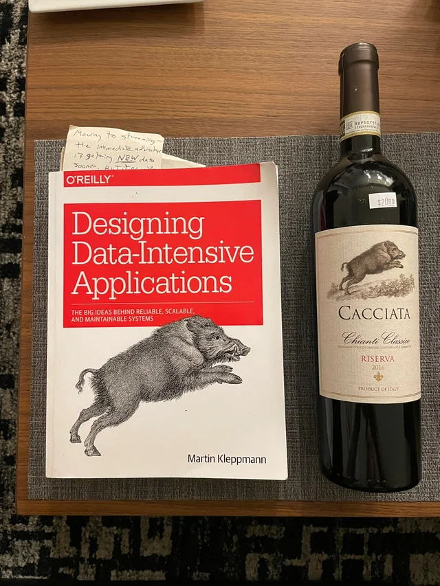

I decided recently to flip the [Dunning Kruger Effect](https://en.m.wikipedia.org/wiki/Dunning%E2%80%93Kruger_effect) and started a antilibrary, for those who are new to the term is it is a term that Nassim Nocholas Taleb mention as "the collection of unread books". I always hated the idea to store books, and have a ego-boosting library.

## Books

- Designing Data Intensive Applications (Kleppman, 2017)
- The Hundred-Page Machine Learning Book (Burkov, 2019)
- The Hundred-Page Language Models Book (Burkov, 2025)
- "Build a Large Language Model" (Raschka, 2024).
- "Building LLMs for Production" (Bouchard and Peters, 2024)
- "LLM Engineer's Handbook" (Iusztin and Labonne, 2024).

## Papers

- Monolith: Real Time Recommendation System With
  Collisionless Embedding Table

\
_If there is a wine, which is half as good as the book. I would buy definitely buy it._

